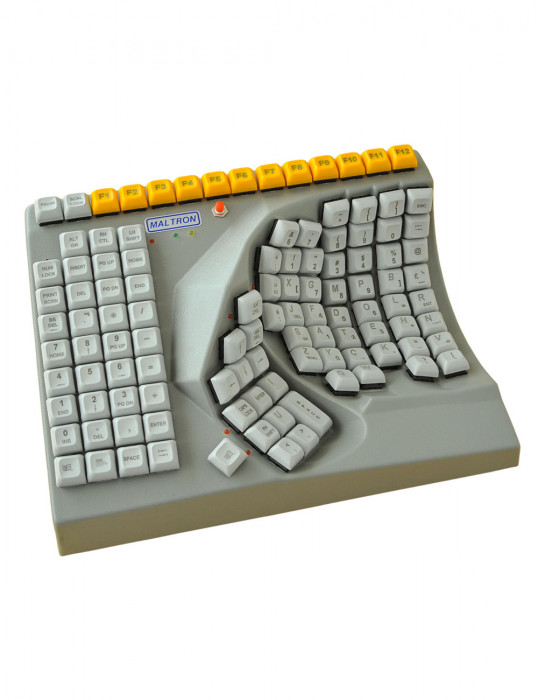

# trochee

The Trochee keyboard is a parameterized, single-handed, concave, columnar, ergonomic keyboard based on the [Dactyl](https://github.com/adereth/dactyl-keyboard) (Pictured below):

Then cross that with the [Maltron](https://www.maltron.com/):

To build a deployable jar of this library:

    $ clojure -A:jar

Install it locally:

    $ clojure -A:install

Deploy it to Clojars -- needs `CLOJARS_USERNAME` and `CLOJARS_PASSWORD` environment variables:

    $ clojure -A:deploy

## License

Copyright © 2020 Bobby Towers

Distributed under the Eclipse Public License either version 1.0 or (at
your option) any later version.
