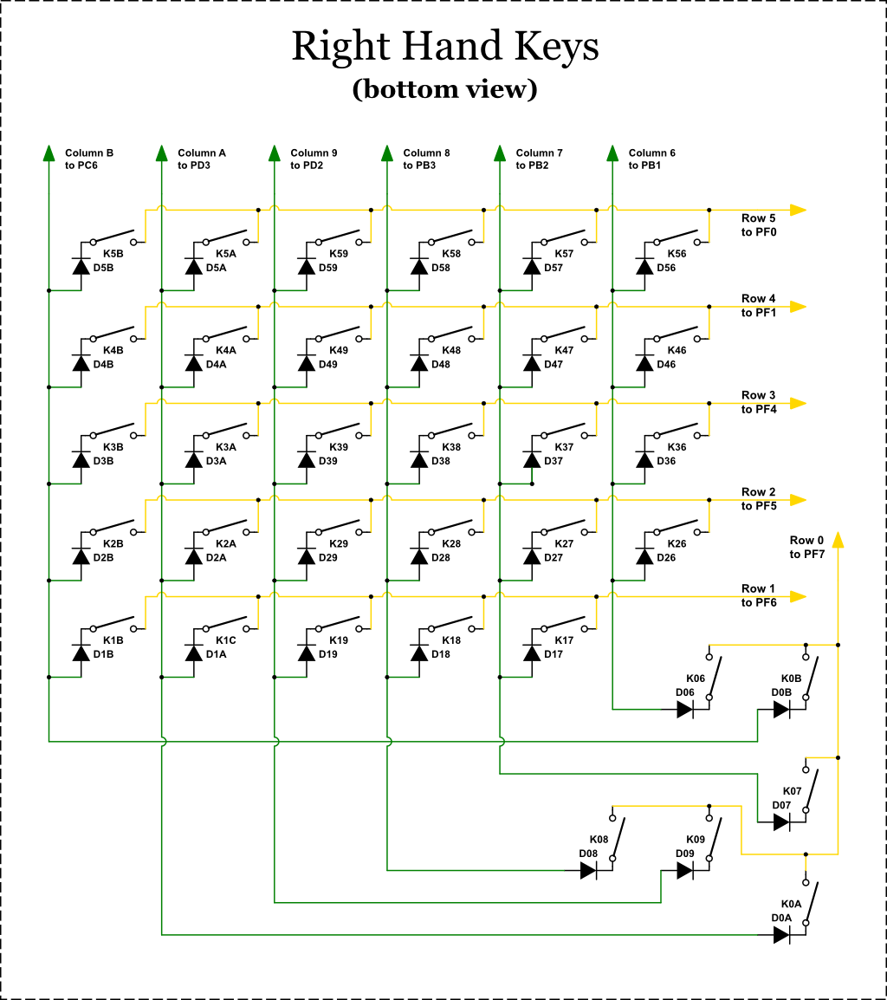

# Backlight Wiring

Adding backlights to your Dactyl creates an aesthetically pleasing effect. Many keyswitches have sockets for through-hole LEDs that can be wired into the main power.

## Unified Wiring Diagram

This diagram shows an overview of the wiring for all the switches, connectors, and LEDs. Don't worry about reproducing the wire routing; you'll likely find routes that are more practical.

Each keyswitch is numbered according to its row/column position. The row/column numbering corresponds to the numbering in the firmware's key-matrix.

The diagram uses a color-coding system for the wires:

* Red: Main power, positive
* Blue: Main power, negative
* Green: Keyswitch column wires
* Yellow: Keyswitch row wires
* Black: TWI/I2C wires (TeensyUSB/MCP23018 communication)

## Separated Wiring Diagrams

Since the unified diagram is fiendishly complex, it's helpful to have separate diagrams for the keys, ICs, and backlight LEDs.

These diagrams use the same numbering system and color-coding as the unified diagram.

