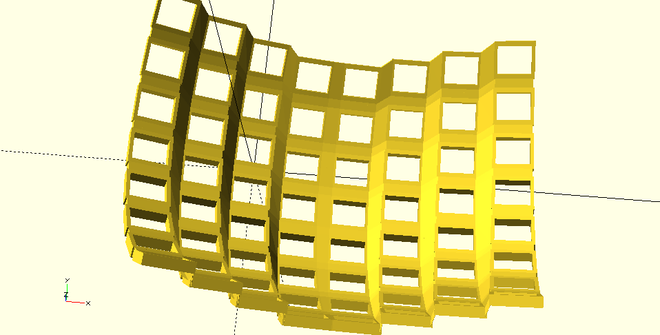
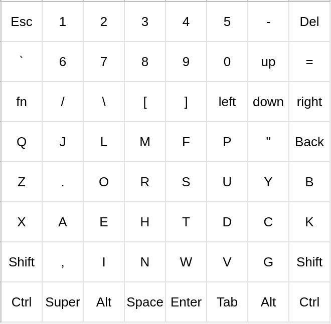

# Trochee design

## Single-board computer inside (or not)

The Trochee keyboard will be designed to optionally house a variety of single-board computers to provide a complete modular computing system, minus a monitor and pointing device. Built-in solutions for these may be explored in the future but are currently out of the scope of initial prototyping.

A few models will be made to house an [AtomicPi](https://www.amazon.com/Atomic-Pi-High-Speed-Peripheral/dp/B07N298F2B) single-board computer. It is sadly a bit underpowered and only has 2GB RAM, but at just $31 for an x86 processor capable of running Windows, they ought to not be passed up. For the first time, a consumer can be offered a complete modular system for a reasonable price without asking them to learn a new operating system, or be limited to using sofware that runs on ARM.

## Key layout

I'm starting with an extremely simple "unified" design, a compact 64-key layout that is an 8x8 square:

Obviously note that there is no thumb cluster. Having never gotten accustomed to one I likely don't know what I'm missing, but removing it really appeals to me in terms of symmetry and space economy. This also allows a single design to be used for a modified left/right handed Dvorak layout:

8 columns were chosen since it will just fit the letters in this configuration. It should be no wider as to minimize lateral finger movement, with 3 extra rows on top for the numbers, arrows and other less frequently used keys.
